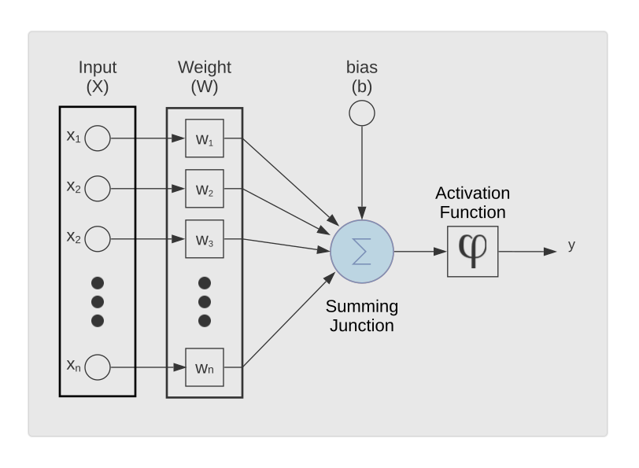
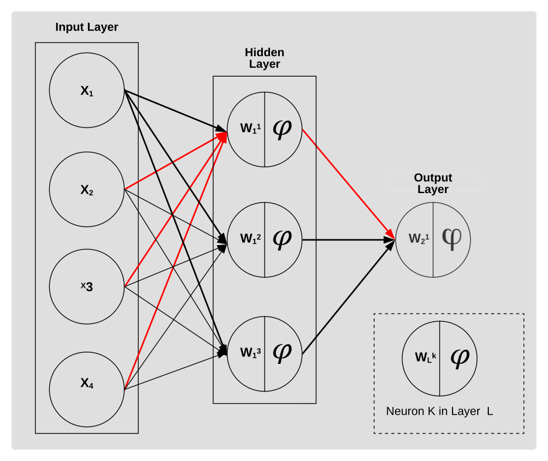

# Neural Network: An Introduction

Artificial neural networks (ANN) are inspired by the biological brain. Neuronal models are the basic building block of any ANN. A general neuronal model contains three basic elements <a ref="http://dai.fmph.uniba.sk/courses/NN/haykin.neural-networks.3ed.2009.pdf">(Haykin et al., 2008)</a>: the synaptic weights, the summing junction, and the activation junction. The synaptic weights can also be viewed as the parameters of the neuron. The activation function of K gives the neuron non-linear properties.

**Figure 1. A nonlinear model of a neuron $$(k)$$ with Input Vector $$(X)$$, Weight$$(W)$$, bias $$(b)$$, an Activation function and output y.**

In mathematical term, a neuron k represented by Figure 1 may be described by the following equations:

$$
 \text{Equation 1: } a_K=w_K^T\ \ (x^{<t>}\ )+b_k 
$$

Equation 1 represents the linear mapping of a signal with the transposed weights vector $$w_K^T$$ and a scalar bias term added by the term. The superscript $$t$$ represents the temporal position of the signal in a sequence.  $$x^{<t>}$$ is a vector of n features. Equation 2 represents a non-linear mapping of, to the neuronal output via the activation function $$\varphi_K(.)$$.
x

 <xml Id = msg SRC = "../images/NN/FeedForwardNet.xml"> </xml>

**Figure 2. Fully connected feedforward network of shape with 4, 3 and 1 neurons in the Input, Hidden and Output layer respectively. The red line shows in Inputs and Output of Neuron 1 in layer 1.**

The simplest network of neurons is called a feed-forward neural network (FNN). In an FNN, the neurons are arranged parallel to each other in a layer (hidden units), see Figure 2. An FNN is characterized by the number of hidden units and the number of neurons in each hidden units. Neuron $$K$$ in layer $$L$$ denoted as NLk, will have as input the vector of output $$Y_{L-1\ }$$ from the previous layer. The output $$Y_L$$ of a layer $$L$$ can be written as follows:

$$A_L=W_L^T\left(Y_{L-1\ }\right)+B_L$$

$$Y_L=\varphi_L\ (A_L)$$

The vector of weights and the bias of each neuron in a layer is represented by the weight matrix WL and the bias vector BL respectively. $$A_L$$ and $$L$$ is the vector of outputs for each neuron from the summing junction and the activation function respectively. The FNN architecture is symmetric, hence if the parameters of the network are initialised with zero, the neurons will effectively learn the same features 
<a href="https://www.nature.com/articles/323533a0">(Rumelhart et al., 1986)</a>
. To break symmetry, small random initialisation was initially proposed 
<a href="http://www.iro.umontreal.ca/~lisa/bib/pub_subject/finance/pointeurs/handbook-patrec.pdf">(Lecun, 1985)</a>
. More recently, the Glorot Initialisation 
<a href="http://proceedings.mlr.press/v9/glorot10a/glorot10a.pdf?source=post_page---------------------------">(Glorot and Bengio, 2010)</a>
 has shown to improve the learning of a feedforward neural network.

